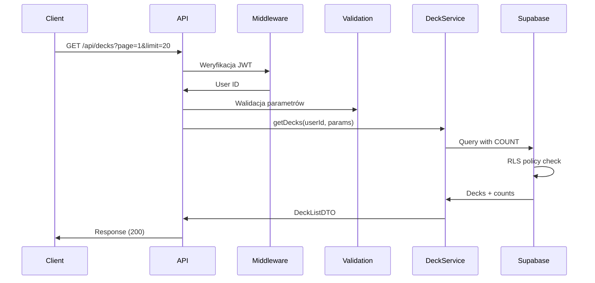
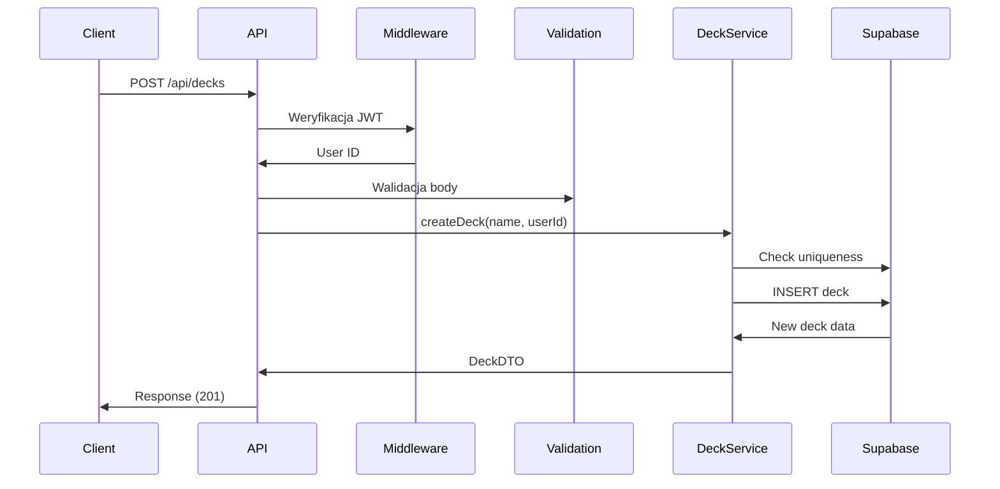
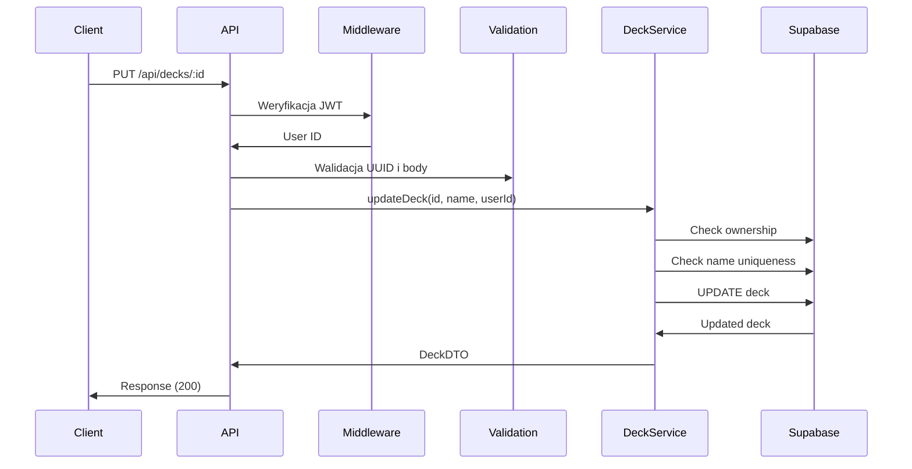
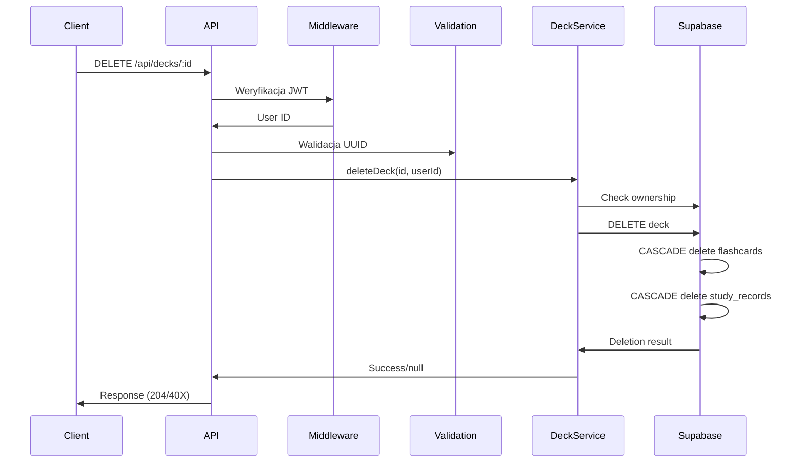

# API Endpoint Implementation Plan: /api/decks

Ten dokument zawiera szczegółowy plan implementacji dla wszystkich endpointów REST API związanych z zarządzaniem taliami (`/api/decks`).

---

## GET /api/decks - Lista talii użytkownika

### 1. Przegląd punktu końcowego

Endpoint służy do pobierania listy wszystkich talii należących do zalogowanego użytkownika. Wspiera paginację, sortowanie oraz zwraca liczbę fiszek dla każdej talii. Jest to kluczowy endpoint używany na ekranie głównym aplikacji do wyświetlania dostępnych talii.

### 2. Szczegóły żądania

- **Metoda HTTP:** GET
- **Struktura URL:** `/api/decks`
- **Parametry query:**
  - Wymagane: brak
  - Opcjonalne:
    - `page` (number) - numer strony, domyślnie 1, minimum 1
    - `limit` (number) - liczba wyników na stronę, domyślnie 20, maksimum 100
    - `sort` (string) - pole sortowania: "name" | "created_at" | "updated_at", domyślnie "updated_at"
    - `order` (string) - kierunek sortowania: "asc" | "desc", domyślnie "desc"
- **Request Body:** Nie dotyczy (GET request)
- **Nagłówki wymagane:**
  - `Authorization: Bearer <token>` - Token JWT z Supabase Auth

### 3. Wykorzystywane typy

```typescript
// Z src/types.ts
interface DeckListQueryParams {
  page?: number;  // default: 1
  limit?: number; // default: 20, max: 100
  sort?: 'name' | 'created_at' | 'updated_at'; // default: 'updated_at'
  order?: SortOrder; // default: 'desc'
}

interface DeckDTO {
  id: string;
  name: string;
  created_at: string;
  updated_at: string;
  flashcard_count: number;
}

interface DeckListDTO {
  data: DeckDTO[];
  pagination: PaginationDTO;
}

interface PaginationDTO {
  page: number;
  limit: number;
  total: number;
  total_pages: number;
}
```

### 4. Szczegóły odpowiedzi

#### Sukces (200 OK)
```json
{
  "data": [
    {
      "id": "550e8400-e29b-41d4-a716-446655440000",
      "name": "JavaScript Basics",
      "flashcard_count": 25,
      "created_at": "2024-01-01T00:00:00Z",
      "updated_at": "2024-01-15T10:30:00Z"
    }
  ],
  "pagination": {
    "page": 1,
    "limit": 20,
    "total": 45,
    "total_pages": 3
  }
}
```

#### Błędy
- **400 Bad Request:** Nieprawidłowe parametry query
- **401 Unauthorized:** Brak lub nieprawidłowy token uwierzytelnienia
- **500 Internal Server Error:** Błąd serwera

### 5. Przepływ danych



### 6. Względy bezpieczeństwa

#### Uwierzytelnianie
- Weryfikacja JWT tokena przez middleware
- Ekstrakcja `user_id` z tokena

#### Autoryzacja
- Filtrowanie tylko po `deck.user_id = authenticated_user_id`
- Supabase RLS policies jako dodatkowa warstwa

#### Walidacja danych
- Walidacja parametrów query za pomocą Zod:
```typescript
const querySchema = z.object({
  page: z.coerce.number().min(1).optional().default(1),
  limit: z.coerce.number().min(1).max(100).optional().default(20),
  sort: z.enum(['name', 'created_at', 'updated_at']).optional().default('updated_at'),
  order: z.enum(['asc', 'desc']).optional().default('desc')
});
```

### 7. Obsługa błędów

| Scenariusz | Kod HTTP | Komunikat | Działanie |
|------------|----------|-----------|-----------|
| Ujemny numer strony | 400 | "Invalid page number" | Zwrot natychmiastowy |
| Limit > 100 | 400 | "Limit exceeds maximum of 100" | Zwrot natychmiastowy |
| Nieprawidłowe pole sortowania | 400 | "Invalid sort field" | Zwrot natychmiastowy |
| Brak tokena | 401 | "Authentication required" | Zwrot natychmiastowy |
| Błąd bazy danych | 500 | "Failed to retrieve decks" | Logowanie, alert |

### 8. Rozważania dotyczące wydajności

#### Optymalizacja zapytań
- Użycie pojedynczego zapytania z LEFT JOIN i GROUP BY:
```sql
SELECT
  d.*,
  COUNT(f.id) as flashcard_count
FROM decks d
LEFT JOIN flashcards f ON f.deck_id = d.id
WHERE d.user_id = $1
GROUP BY d.id
ORDER BY d.[sort_field] [order]
LIMIT $2 OFFSET $3
```

#### Caching
- Cache-Control: `private, max-age=60` dla krótkotrwałego cache
- Invalidacja przy operacjach CREATE/UPDATE/DELETE

#### Indeksy
- Indeks na `decks.user_id` (już istnieje)
- Indeks złożony na `(user_id, updated_at)` dla częstego sortowania

### 9. Etapy wdrożenia

#### Krok 1: Rozszerzenie DeckService
```typescript
// src/services/deck.service.ts
async getDecks(
  userId: string,
  params: DeckListQueryParams
): Promise<DeckListDTO> {
  // Implementacja z paginacją i liczeniem
}
```

#### Krok 2: Utworzenie schematu walidacji
```typescript
// src/schemas/deck.schema.ts
export const deckListQuerySchema = z.object({
  page: z.coerce.number().min(1).optional().default(1),
  limit: z.coerce.number().min(1).max(100).optional().default(20),
  sort: z.enum(['name', 'created_at', 'updated_at']).optional().default('updated_at'),
  order: z.enum(['asc', 'desc']).optional().default('desc')
});
```

#### Krok 3: Implementacja endpointu
```typescript
// src/pages/api/decks/index.ts
export const GET: APIRoute = async ({ url, locals }) => {
  // 1. Sprawdzenie uwierzytelnienia
  // 2. Walidacja parametrów query
  // 3. Wywołanie DeckService.getDecks()
  // 4. Zwrócenie odpowiedzi
}
```

---

## POST /api/decks - Tworzenie nowej talii

### 1. Przegląd punktu końcowego

Endpoint służy do tworzenia nowej talii fiszek. Nazwa talii musi być unikalna dla danego użytkownika. Po utworzeniu talii zwraca pełne dane utworzonego obiektu.

### 2. Szczegóły żądania

- **Metoda HTTP:** POST
- **Struktura URL:** `/api/decks`
- **Parametry:** brak
- **Request Body:**
```json
{
  "name": "JavaScript Advanced" // 1-255 znaków, wymagane
}
```
- **Nagłówki wymagane:**
  - `Authorization: Bearer <token>` - Token JWT
  - `Content-Type: application/json`

### 3. Wykorzystywane typy

```typescript
// Z src/types.ts
interface CreateDeckCommand {
  name: string; // 1-255 characters, trimmed
}

interface DeckDTO {
  id: string;
  name: string;
  created_at: string;
  updated_at: string;
  flashcard_count: number;
}
```

### 4. Szczegóły odpowiedzi

#### Sukces (201 Created)
```json
{
  "id": "550e8400-e29b-41d4-a716-446655440000",
  "name": "JavaScript Advanced",
  "flashcard_count": 0,
  "created_at": "2024-01-01T00:00:00Z",
  "updated_at": "2024-01-01T00:00:00Z"
}
```

Headers:
- `Location: /api/decks/550e8400-e29b-41d4-a716-446655440000`

#### Błędy
- **400 Bad Request:** Błąd walidacji (np. nazwa za krótka/długa)
- **401 Unauthorized:** Brak uwierzytelnienia
- **409 Conflict:** Talia o tej nazwie już istnieje dla użytkownika
- **500 Internal Server Error:** Błąd serwera

### 5. Przepływ danych



### 6. Względy bezpieczeństwa

#### Uwierzytelnianie
- Weryfikacja JWT tokena
- Przypisanie `user_id` z tokena (nie z body)

#### Walidacja danych
```typescript
const createDeckSchema = z.object({
  name: z.string()
    .min(1, "Deck name is required")
    .max(255, "Deck name must be less than 255 characters")
    .transform(val => val.trim())
});
```

#### Ochrona przed duplikatami
- Sprawdzenie unikalności na poziomie aplikacji przed INSERT
- UNIQUE constraint w bazie jako zabezpieczenie

### 7. Obsługa błędów

| Scenariusz | Kod HTTP | Komunikat | Działanie |
|------------|----------|-----------|-----------|
| Pusta nazwa | 400 | "Deck name is required" | Zwrot natychmiastowy |
| Nazwa > 255 znaków | 400 | "Deck name must be less than 255 characters" | Zwrot natychmiastowy |
| Brak tokena | 401 | "Authentication required" | Zwrot natychmiastowy |
| Duplikat nazwy | 409 | "Deck with this name already exists" | Zwrot natychmiastowy |
| Błąd DB | 500 | "Failed to create deck" | Logowanie, alert |

### 8. Rozważania dotyczące wydajności

#### Transakcyjność
- Sprawdzenie unikalności i INSERT w jednej transakcji
- Użycie `ON CONFLICT` clause:
```sql
INSERT INTO decks (name, user_id)
VALUES ($1, $2)
ON CONFLICT (user_id, name) DO NOTHING
RETURNING *;
```

### 9. Etapy wdrożenia

#### Krok 1: Rozszerzenie DeckService
```typescript
// src/services/deck.service.ts
async createDeck(name: string, userId: string): Promise<DeckDTO> {
  // Sprawdzenie unikalności
  // INSERT z obsługą konfliktu
  // Zwrócenie DeckDTO
}
```

#### Krok 2: Schemat walidacji
```typescript
// src/schemas/deck.schema.ts
export const createDeckSchema = z.object({
  name: z.string()
    .min(1, "Deck name is required")
    .max(255, "Deck name must be less than 255 characters")
    .transform(val => val.trim())
});
```

#### Krok 3: Implementacja endpointu
```typescript
// src/pages/api/decks/index.ts
export const POST: APIRoute = async ({ request, locals }) => {
  // 1. Sprawdzenie uwierzytelnienia
  // 2. Parsowanie i walidacja body
  // 3. Wywołanie DeckService.createDeck()
  // 4. Zwrócenie 201 z Location header
}
```

---

## PUT /api/decks/:id - Aktualizacja talii

### 1. Przegląd punktu końcowego

Endpoint służy do aktualizacji nazwy istniejącej talii. Sprawdza właściciela talii oraz unikalność nowej nazwy.

### 2. Szczegóły żądania

- **Metoda HTTP:** PUT
- **Struktura URL:** `/api/decks/:id`
- **Parametry:**
  - Wymagane:
    - `:id` (UUID) - Identyfikator talii w ścieżce URL
- **Request Body:**
```json
{
  "name": "Updated Deck Name" // 1-255 znaków, wymagane
}
```
- **Nagłówki wymagane:**
  - `Authorization: Bearer <token>`
  - `Content-Type: application/json`

### 3. Wykorzystywane typy

```typescript
// Z src/types.ts
interface UpdateDeckCommand {
  name: string; // 1-255 characters, trimmed
}

interface DeckDTO {
  id: string;
  name: string;
  created_at: string;
  updated_at: string;
  flashcard_count: number;
}
```

### 4. Szczegóły odpowiedzi

#### Sukces (200 OK)
```json
{
  "id": "550e8400-e29b-41d4-a716-446655440000",
  "name": "Updated Deck Name",
  "flashcard_count": 25,
  "created_at": "2024-01-01T00:00:00Z",
  "updated_at": "2024-01-15T15:45:00Z"
}
```

#### Błędy
- **400 Bad Request:** Nieprawidłowy format UUID lub błąd walidacji
- **401 Unauthorized:** Brak uwierzytelnienia
- **403 Forbidden:** Brak uprawnień do tej talii
- **404 Not Found:** Talia nie istnieje
- **409 Conflict:** Nazwa już zajęta przez inną talię użytkownika
- **500 Internal Server Error:** Błąd serwera

### 5. Przepływ danych



### 6. Względy bezpieczeństwa

#### Uwierzytelnianie i Autoryzacja
- Weryfikacja JWT tokena
- Sprawdzenie czy `deck.user_id = authenticated_user_id`
- Zwrot 403 (nie 404) gdy brak uprawnień

#### Walidacja danych
```typescript
const updateDeckParamsSchema = z.object({
  id: z.string().uuid("Invalid deck ID format")
});

const updateDeckBodySchema = z.object({
  name: z.string()
    .min(1, "Deck name is required")
    .max(255, "Deck name must be less than 255 characters")
    .transform(val => val.trim())
});
```

### 7. Obsługa błędów

| Scenariusz | Kod HTTP | Komunikat | Działanie |
|------------|----------|-----------|-----------|
| Nieprawidłowy UUID | 400 | "Invalid deck ID format" | Zwrot natychmiastowy |
| Pusta nazwa | 400 | "Deck name is required" | Zwrot natychmiastowy |
| Brak tokena | 401 | "Authentication required" | Zwrot natychmiastowy |
| Talia innego użytkownika | 403 | "Access denied" | Logowanie próby |
| Talia nie istnieje | 404 | "Deck not found" | Zwrot natychmiastowy |
| Duplikat nazwy | 409 | "Deck with this name already exists" | Zwrot natychmiastowy |

### 8. Rozważania dotyczące wydajności

#### Optymalizacja zapytań
- Pojedyncze zapytanie z warunkami:
```sql
UPDATE decks
SET name = $1, updated_at = NOW()
WHERE id = $2 AND user_id = $3
RETURNING *, (SELECT COUNT(*) FROM flashcards WHERE deck_id = $2) as flashcard_count;
```

### 9. Etapy wdrożenia

#### Krok 1: Rozszerzenie DeckService
```typescript
// src/services/deck.service.ts
async updateDeck(
  deckId: string,
  name: string,
  userId: string
): Promise<DeckDTO | null> {
  // Sprawdzenie właściciela i unikalności
  // UPDATE z liczeniem fiszek
  // Zwrócenie DeckDTO lub null
}
```

#### Krok 2: Schematy walidacji
```typescript
// src/schemas/deck.schema.ts
export const updateDeckParamsSchema = z.object({
  id: z.string().uuid("Invalid deck ID format")
});

export const updateDeckBodySchema = z.object({
  name: z.string()
    .min(1, "Deck name is required")
    .max(255, "Deck name must be less than 255 characters")
    .transform(val => val.trim())
});
```

#### Krok 3: Implementacja endpointu
```typescript
// src/pages/api/decks/[id].ts
export const PUT: APIRoute = async ({ params, request, locals }) => {
  // 1. Sprawdzenie uwierzytelnienia
  // 2. Walidacja parametrów i body
  // 3. Wywołanie DeckService.updateDeck()
  // 4. Obsługa różnych scenariuszy (403/404/409)
  // 5. Zwrócenie 200 z zaktualizowanymi danymi
}
```

---

## DELETE /api/decks/:id - Usunięcie talii

### 1. Przegląd punktu końcowego

Endpoint służy do usunięcia talii wraz ze wszystkimi zawartymi w niej fiszkami i rekordami nauki. Operacja jest nieodwracalna i wykorzystuje CASCADE constraints w bazie danych.

### 2. Szczegóły żądania

- **Metoda HTTP:** DELETE
- **Struktura URL:** `/api/decks/:id`
- **Parametry:**
  - Wymagane:
    - `:id` (UUID) - Identyfikator talii w ścieżce URL
- **Request Body:** Brak
- **Nagłówki wymagane:**
  - `Authorization: Bearer <token>`

### 3. Wykorzystywane typy

```typescript
// Tylko walidacja parametrów
interface DeleteDeckParams {
  id: string; // UUID
}

// Brak response body (204 No Content)
```

### 4. Szczegóły odpowiedzi

#### Sukces (204 No Content)
- Brak body w odpowiedzi
- Status 204 oznacza pomyślne usunięcie

#### Błędy
- **400 Bad Request:** Nieprawidłowy format UUID
- **401 Unauthorized:** Brak uwierzytelnienia
- **403 Forbidden:** Brak uprawnień do tej talii
- **404 Not Found:** Talia nie istnieje
- **500 Internal Server Error:** Błąd serwera

### 5. Przepływ danych



### 6. Względy bezpieczeństwa

#### Uwierzytelnianie i Autoryzacja
- Weryfikacja JWT tokena
- Sprawdzenie właściciela przed usunięciem
- Rozróżnienie 403 (brak uprawnień) od 404 (nie istnieje)

#### Walidacja danych
```typescript
const deleteDeckParamsSchema = z.object({
  id: z.string().uuid("Invalid deck ID format")
});
```

#### Zabezpieczenia przed przypadkowym usunięciem
- Brak soft-delete w MVP (zgodnie z PRD)
- Frontend powinien wymagać potwierdzenia
- Logowanie operacji usunięcia

### 7. Obsługa błędów

| Scenariusz | Kod HTTP | Komunikat | Działanie |
|------------|----------|-----------|-----------|
| Nieprawidłowy UUID | 400 | "Invalid deck ID format" | Zwrot natychmiastowy |
| Brak tokena | 401 | "Authentication required" | Zwrot natychmiastowy |
| Talia innego użytkownika | 403 | "Access denied" | Logowanie próby |
| Talia nie istnieje | 404 | "Deck not found" | Zwrot natychmiastowy |
| Błąd CASCADE | 500 | "Failed to delete deck" | Logowanie, alert |

### 8. Rozważania dotyczące wydajności

#### CASCADE Performance
- Foreign key constraints z ON DELETE CASCADE:
  - `flashcards.deck_id` → automatyczne usunięcie fiszek
  - `study_records.flashcard_id` → automatyczne usunięcie rekordów
- Indeksy na foreign keys dla szybkiego CASCADE

#### Transakcyjność
- Cała operacja w jednej transakcji
- Rollback przy błędzie

### 9. Etapy wdrożenia

#### Krok 1: Rozszerzenie DeckService
```typescript
// src/services/deck.service.ts
async deleteDeck(deckId: string, userId: string): Promise<boolean> {
  // Sprawdzenie właściciela
  // DELETE z warunkiem user_id
  // Zwrot true/false
}
```

#### Krok 2: Schemat walidacji
```typescript
// src/schemas/deck.schema.ts
export const deleteDeckParamsSchema = z.object({
  id: z.string().uuid("Invalid deck ID format")
});
```

#### Krok 3: Implementacja endpointu
```typescript
// src/pages/api/decks/[id].ts
export const DELETE: APIRoute = async ({ params, locals }) => {
  // 1. Sprawdzenie uwierzytelnienia
  // 2. Walidacja parametrów
  // 3. Wywołanie DeckService.deleteDeck()
  // 4. Rozróżnienie 403 vs 404
  // 5. Zwrócenie 204 (bez body)
}
```

#### Krok 4: Weryfikacja CASCADE
- Testy integracyjne sprawdzające usunięcie:
  - Talii
  - Wszystkich fiszek talii
  - Wszystkich study_records powiązanych z fiszkami

---

## Wspólne komponenty dla wszystkich endpointów

### Rozszerzona klasa DeckService

```typescript
// src/services/deck.service.ts
export class DeckService {
  constructor(private supabase: SupabaseClient<Database>) {}

  // Istniejąca metoda
  async getDeckWithFlashcards(deckId: string, userId: string): Promise<DeckWithFlashcardsDTO | null> {
    // ...już zaimplementowana
  }

  // Nowe metody do implementacji
  async getDecks(userId: string, params: DeckListQueryParams): Promise<DeckListDTO> {
    // Implementacja z paginacją
  }

  async createDeck(name: string, userId: string): Promise<DeckDTO> {
    // Implementacja z sprawdzeniem unikalności
  }

  async updateDeck(deckId: string, name: string, userId: string): Promise<DeckDTO | null> {
    // Implementacja z weryfikacją właściciela
  }

  async deleteDeck(deckId: string, userId: string): Promise<boolean> {
    // Implementacja z CASCADE
  }
}
```

### Plik routingu API

```typescript
// src/pages/api/decks/index.ts
import type { APIRoute } from "astro";

export const prerender = false;

// GET /api/decks - lista talii
export const GET: APIRoute = async ({ url, locals }) => {
  // Implementacja
};

// POST /api/decks - tworzenie talii
export const POST: APIRoute = async ({ request, locals }) => {
  // Implementacja
};
```

```typescript
// src/pages/api/decks/[id].ts
import type { APIRoute } from "astro";

export const prerender = false;

// GET /api/decks/:id - szczegóły talii (już zaimplementowane)
export const GET: APIRoute = async ({ params, locals }) => {
  // ...istniejąca implementacja
};

// PUT /api/decks/:id - aktualizacja talii
export const PUT: APIRoute = async ({ params, request, locals }) => {
  // Implementacja
};

// DELETE /api/decks/:id - usunięcie talii
export const DELETE: APIRoute = async ({ params, locals }) => {
  // Implementacja
};
```

### Schematy walidacji

```typescript
// src/schemas/deck.schema.ts

// Istniejący schemat
export const getDeckParamsSchema = z.object({
  id: z.string().uuid("Invalid deck ID format"),
});

// Nowe schematy
export const deckListQuerySchema = z.object({
  page: z.coerce.number().min(1).optional().default(1),
  limit: z.coerce.number().min(1).max(100).optional().default(20),
  sort: z.enum(['name', 'created_at', 'updated_at']).optional().default('updated_at'),
  order: z.enum(['asc', 'desc']).optional().default('desc')
});

export const createDeckSchema = z.object({
  name: z.string()
    .min(1, "Deck name is required")
    .max(255, "Deck name must be less than 255 characters")
    .transform(val => val.trim())
});

export const updateDeckParamsSchema = z.object({
  id: z.string().uuid("Invalid deck ID format")
});

export const updateDeckBodySchema = z.object({
  name: z.string()
    .min(1, "Deck name is required")
    .max(255, "Deck name must be less than 255 characters")
    .transform(val => val.trim())
});

export const deleteDeckParamsSchema = z.object({
  id: z.string().uuid("Invalid deck ID format")
});
```

---

## Podsumowanie priorytetów implementacji

1. **GET /api/decks** - Krytyczny dla wyświetlania listy talii (ekran główny)
2. **POST /api/decks** - Krytyczny dla tworzenia nowych talii
3. **DELETE /api/decks/:id** - Ważny dla zarządzania taliami
4. **PUT /api/decks/:id** - Mniej krytyczny, ale potrzebny do edycji nazw

## Metryki sukcesu

- Wszystkie endpointy zwracają poprawne kody statusu HTTP
- Czas odpowiedzi < 200ms dla operacji READ
- Czas odpowiedzi < 500ms dla operacji WRITE
- 100% pokrycie testami jednostkowymi dla walidacji
- 100% pokrycie testami integracyjnymi dla głównych ścieżek
- Brak wycieków danych między użytkownikami (RLS)