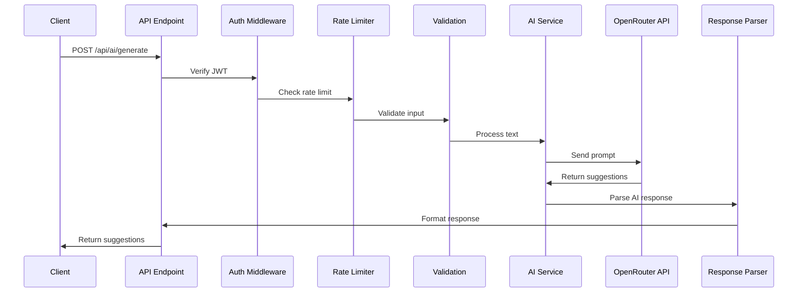

# API Endpoint Implementation Plan: AI Flashcard Generation

## 1. Endpoint Overview

The `/api/ai/generate` endpoint leverages GPT-4o-mini via OpenRouter to automatically generate educational flashcards from user-provided text. This endpoint transforms raw text into structured question-answer pairs, enabling rapid content creation for study decks while maintaining educational quality and relevance.

## 2. Request Details

- **HTTP Method:** POST
- **URL Structure:** `/api/ai/generate`
- **Parameters:**
  - Required: None (all data in request body)
  - Optional: None
- **Request Body:**
  ```json
  {
    "text": "string (1-1000 characters, required)"
  }
  ```
- **Headers Required:**
  - `Authorization: Bearer <jwt_token>` (Supabase Auth)
  - `Content-Type: application/json`

## 3. Utilized Types

```typescript
// Input Command (from types.ts)
interface GenerateFlashcardsCommand {
  text: string; // 1-1000 characters, auto-truncated if exceeded
}

// Response DTOs (from types.ts)
interface FlashcardSuggestion {
  front: string;
  back: string;
}

interface GenerateFlashcardsResponseDTO {
  suggestions: FlashcardSuggestion[];
  count: number;
  truncated: boolean; // Indicates if input was truncated
}

interface ErrorResponseDTO {
  error: string;
  details?: unknown[];
  retry_after?: number; // For rate limiting
}
```

## 4. Response Details

### Success Response (200 OK)
```json
{
  "suggestions": [
    {
      "front": "What is the capital of France?",
      "back": "Paris"
    },
    // ... up to 5 suggestions
  ],
  "count": 5,
  "truncated": false
}
```

### Error Responses
- **400 Bad Request:** Invalid or empty text input
- **401 Unauthorized:** Missing or invalid authentication
- **429 Too Many Requests:** Rate limit exceeded (10 req/min)
- **500 Internal Server Error:** Unexpected server error
- **503 Service Unavailable:** AI service temporarily unavailable

## 5. Data Flow



### Detailed Flow Steps:
1. **Authentication:** Verify user JWT via Supabase middleware
2. **Rate Limiting:** Check user's request count (Redis or in-memory cache)
3. **Input Validation:** Validate and sanitize text input
4. **Text Truncation:** If text > 1000 chars, truncate and set flag
5. **Prompt Engineering:** Construct system and user prompts
6. **API Call:** Send request to OpenRouter with GPT-4o-mini
7. **Response Parsing:** Extract flashcard pairs from AI response
8. **Response Formatting:** Structure final response with metadata

## 6. Security Considerations

### API Key Protection
- Store `OPENROUTER_API_KEY` in environment variables
- Never expose key in client-side code or response
- Use server-side endpoint exclusively

### Input Sanitization
```typescript
// Prevent prompt injection
const sanitizedText = text
  .replace(/\n{3,}/g, '\n\n') // Limit consecutive newlines
  .replace(/[<>]/g, '') // Remove angle brackets
  .trim()
  .slice(0, 1000); // Enforce character limit
```

### Rate Limiting Implementation
```typescript
// Per-user rate limiting (10 requests/minute)
const rateLimitKey = `ai_gen:${userId}`;
const currentCount = await getRateLimitCount(rateLimitKey);

if (currentCount >= 10) {
  const ttl = await getTTL(rateLimitKey);
  return new Response(JSON.stringify({
    error: "Rate limit exceeded",
    retry_after: ttl
  }), { status: 429 });
}
```

### Authorization
- Verify user owns the target deck (if deck_id provided in future)
- Ensure user profile exists and is active
- Log all generation requests for audit trail

## 7. Error Handling

### Validation Errors
```typescript
const schema = z.object({
  text: z.string()
    .min(1, "Text cannot be empty")
    .max(1000, "Text exceeds maximum length")
    .transform(str => str.trim())
});
```

### API Service Errors
```typescript
try {
  const response = await fetch(OPENROUTER_URL, options);

  if (!response.ok) {
    if (response.status === 429) {
      // OpenRouter rate limit
      throw new ServiceUnavailableError("AI service is busy");
    }
    throw new Error(`OpenRouter API error: ${response.status}`);
  }
} catch (error) {
  // Log to monitoring service
  console.error('AI Generation Error:', error);

  if (error instanceof ServiceUnavailableError) {
    return new Response(JSON.stringify({
      error: "AI service temporarily unavailable"
    }), { status: 503 });
  }

  return new Response(JSON.stringify({
    error: "Failed to generate flashcards"
  }), { status: 500 });
}
```

### Timeout Handling
```typescript
const controller = new AbortController();
const timeout = setTimeout(() => controller.abort(), 5000); // 5 second timeout

try {
  const response = await fetch(url, {
    ...options,
    signal: controller.signal
  });
} finally {
  clearTimeout(timeout);
}
```

## 8. Performance Considerations

### Response Time Optimization
- **Target:** P95 < 5 seconds
- **Monitoring:** Track response times per request
- **Caching:** Consider caching similar requests (with user consent)

### Prompt Optimization
```typescript
const systemPrompt = `You are an expert educator creating concise flashcards.
Rules:
- Generate exactly 5 flashcards
- Keep answers brief and factual
- Focus on key concepts
- Return JSON format: [{"front": "question", "back": "answer"}]`;

const userPrompt = `Create 5 educational flashcards from this text:
${sanitizedText}`;
```

### Resource Management
- Implement connection pooling for external API calls
- Use streaming responses if OpenRouter supports it
- Consider implementing request queuing during high load

## 9. Implementation Steps

### Step 1: Create Validation Schema
```typescript
// src/schemas/ai-generation.schema.ts
import { z } from 'zod';

export const generateFlashcardsSchema = z.object({
  text: z.string()
    .min(1, "Text is required")
    .max(1000, "Text exceeds 1000 character limit")
    .transform(str => str.trim())
});
```

### Step 2: Implement Rate Limiting Utility
```typescript
// src/services/rate-limiter.service.ts
interface RateLimitResult {
  allowed: boolean;
  remaining: number;
  resetIn: number;
}

export async function checkRateLimit(
  userId: string,
  limit: number = 10,
  window: number = 60
): Promise<RateLimitResult> {
  // Implementation using Redis or in-memory store
}
```

### Step 3: Create AI Generation Service
```typescript
// src/services/ai-generation.service.ts
export class AIGenerationService {
  private readonly apiKey: string;
  private readonly apiUrl: string;

  constructor() {
    this.apiKey = process.env.OPENROUTER_API_KEY!;
    this.apiUrl = 'https://openrouter.ai/api/v1/chat/completions';
  }

  async generateFlashcards(text: string): Promise<FlashcardSuggestion[]> {
    // Implement OpenRouter API call
    // Handle prompt engineering
    // Parse and validate response
  }
}
```

### Step 4: Implement API Endpoint
```typescript
// src/pages/api/ai/generate.ts
import type { APIRoute } from 'astro';
import { z } from 'zod';
import { generateFlashcardsSchema } from '@/schemas/ai-generation.schema';
import { AIGenerationService } from '@/services/ai-generation.service';
import { checkRateLimit } from '@/services/rate-limiter.service';

export const prerender = false;

export const POST: APIRoute = async ({ request, locals }) => {
  // Step 1: Verify authentication
  const user = locals.user;
  if (!user) {
    return new Response(JSON.stringify({
      error: "Authentication required"
    }), { status: 401 });
  }

  // Step 2: Check rate limit
  const rateLimit = await checkRateLimit(user.id);
  if (!rateLimit.allowed) {
    return new Response(JSON.stringify({
      error: "Rate limit exceeded",
      retry_after: rateLimit.resetIn
    }), { status: 429 });
  }

  // Step 3: Parse and validate input
  try {
    const body = await request.json();
    const validated = generateFlashcardsSchema.parse(body);

    // Step 4: Check for truncation
    const truncated = body.text?.length > 1000;
    const processedText = validated.text.slice(0, 1000);

    // Step 5: Generate flashcards
    const aiService = new AIGenerationService();
    const suggestions = await aiService.generateFlashcards(processedText);

    // Step 6: Return response
    return new Response(JSON.stringify({
      suggestions,
      count: suggestions.length,
      truncated
    }), {
      status: 200,
      headers: {
        'Content-Type': 'application/json',
        'X-RateLimit-Remaining': String(rateLimit.remaining - 1),
        'X-RateLimit-Reset': String(rateLimit.resetIn)
      }
    });

  } catch (error) {
    if (error instanceof z.ZodError) {
      return new Response(JSON.stringify({
        error: "Validation failed",
        details: error.errors
      }), { status: 400 });
    }

    // Log error for monitoring
    console.error('AI Generation Error:', error);

    return new Response(JSON.stringify({
      error: "Failed to generate flashcards"
    }), { status: 500 });
  }
};
```

### Step 5: Add OpenRouter Response Parser
```typescript
// src/utils/ai-response-parser.ts
export function parseAIResponse(response: any): FlashcardSuggestion[] {
  try {
    const content = response.choices[0]?.message?.content;
    const parsed = JSON.parse(content);

    // Validate structure
    if (!Array.isArray(parsed)) {
      throw new Error('Invalid response format');
    }

    return parsed
      .slice(0, 5) // Maximum 5 flashcards
      .map(item => ({
        front: String(item.front || '').trim(),
        back: String(item.back || '').trim()
      }))
      .filter(card => card.front && card.back); // Remove empty cards

  } catch (error) {
    console.error('Failed to parse AI response:', error);
    return [];
  }
}
```

### Step 6: Configure Environment Variables
```bash
# .env.local
OPENROUTER_API_KEY=your_openrouter_api_key_here
```

```typescript
// src/env.d.ts
interface ImportMetaEnv {
  readonly OPENROUTER_API_KEY: string;
  // ... other env vars
}
```

### Step 7: Add Monitoring and Logging
```typescript
// Track performance metrics
const startTime = performance.now();
// ... AI generation logic
const responseTime = performance.now() - startTime;

// Log for P95 analysis
console.log('AI Generation Metrics:', {
  userId: user.id,
  responseTime,
  flashcardCount: suggestions.length,
  textLength: processedText.length,
  truncated
});
```

### Step 8: Implement Error Recovery
```typescript
// Retry logic with exponential backoff
async function retryWithBackoff<T>(
  fn: () => Promise<T>,
  maxRetries: number = 3
): Promise<T> {
  for (let i = 0; i < maxRetries; i++) {
    try {
      return await fn();
    } catch (error) {
      if (i === maxRetries - 1) throw error;
      await new Promise(resolve =>
        setTimeout(resolve, Math.pow(2, i) * 1000)
      );
    }
  }
  throw new Error('Max retries exceeded');
}
```

## Additional Considerations

### Future Enhancements
- Implement response streaming for better UX
- Add language detection for multilingual support
- Cache common requests to improve response times
- Add webhook for async generation of large batches

### Monitoring Requirements
- Track P95 response times
- Monitor OpenRouter API availability
- Log rate limit violations
- Track acceptance rate for generated flashcards (KSM 1)

### Testing Strategy
- Unit tests for validation and parsing logic
- Integration tests with mock OpenRouter responses
- Load testing to verify P95 < 5 seconds
- Rate limiting verification tests