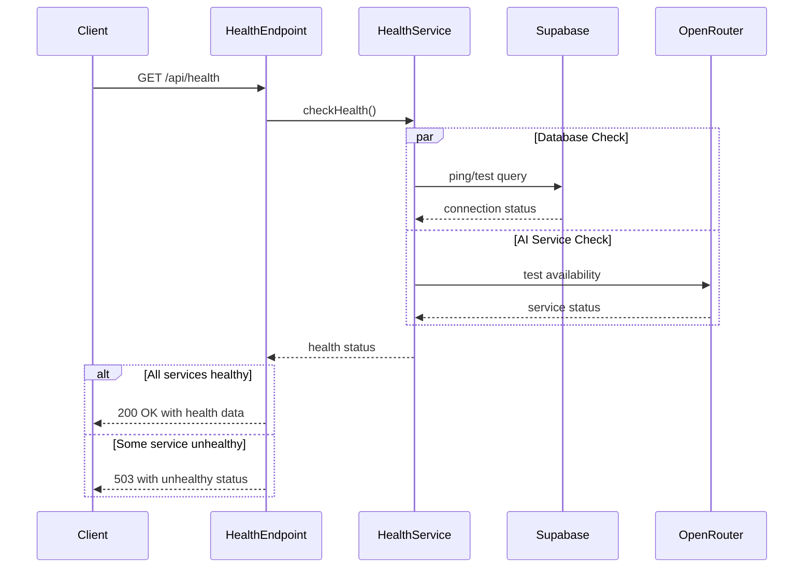

# API Endpoint Implementation Plan: Health Check

## 1. Przegląd punktu końcowego

Endpoint `/api/health` służy do monitorowania stanu aplikacji przez systemy zewnętrzne (load balancery, monitoring). Sprawdza dostępność kluczowych usług (baza danych, AI service) i zwraca zagregowany status aplikacji. Jest to publiczny endpoint niewymagający uwierzytelniania.

## 2. Szczegóły żądania

- **Metoda HTTP:** GET
- **Struktura URL:** `/api/health`
- **Parametry:**
  - Wymagane: Brak
  - Opcjonalne: Brak
- **Request Body:** Brak
- **Nagłówki:** Brak specjalnych wymagań
- **Uwierzytelnianie:** Nie wymagane (publiczny endpoint)

## 3. Wykorzystywane typy

```typescript
// Z src/types.ts - już zdefiniowane
interface HealthCheckDTO {
  status: "healthy" | "unhealthy";
  version: string;
  timestamp: string; // ISO 8601 timestamp
  services: {
    database: ServiceStatus;
    ai_service: ServiceStatus;
  };
}

type ServiceStatus = "connected" | "disconnected" | "available" | "unavailable";
```

## 4. Szczegóły odpowiedzi

### Sukces (200 OK)
```json
{
  "status": "healthy",
  "version": "1.0.0",
  "timestamp": "2024-01-01T00:00:00Z",
  "services": {
    "database": "connected",
    "ai_service": "available"
  }
}
```

### Błąd usługi (503 Service Unavailable)
```json
{
  "status": "unhealthy",
  "version": "1.0.0",
  "timestamp": "2024-01-01T00:00:00Z",
  "services": {
    "database": "disconnected",
    "ai_service": "available"
  }
}
```

## 5. Przepływ danych



## 6. Względy bezpieczeństwa

### Rate Limiting
- Implementacja rate limitingu dla ochrony przed atakami DoS
- Sugerowany limit: 10 żądań na minutę per IP

### Informacje wrażliwe
- NIE ujawniać szczegółów wersji bazy danych
- NIE ujawniać wewnętrznych adresów IP lub hostów
- NIE ujawniać szczegółowych komunikatów błędów

### CORS
- Endpoint publiczny - dozwolone żądania z dowolnej domeny
- Metoda dozwolona: tylko GET

## 7. Obsługa błędów

| Scenariusz | Kod statusu | Odpowiedź |
|------------|-------------|-----------|
| Wszystkie usługi działają | 200 | HealthCheckDTO z status="healthy" |
| Baza danych niedostępna | 503 | HealthCheckDTO z status="unhealthy", database="disconnected" |
| AI service niedostępny | 503 | HealthCheckDTO z status="unhealthy", ai_service="unavailable" |
| Obie usługi niedostępne | 503 | HealthCheckDTO z status="unhealthy", obie usługi oznaczone jako niedostępne |
| Błąd wewnętrzny podczas sprawdzania | 503 | HealthCheckDTO z status="unhealthy", domyślne wartości dla usług |

## 8. Rozważania dotyczące wydajności

### Caching
- Implementacja cache'owania wyników health check (TTL: 5-10 sekund)
- Zapobiega przeciążeniu przy częstych zapytaniach od load balancerów

### Timeouty
- Timeout dla sprawdzenia bazy danych: 3 sekundy
- Timeout dla sprawdzenia AI service: 5 sekund
- Całkowity timeout endpointu: 10 sekund

### Optymalizacje
- Równoległe sprawdzanie usług (Promise.allSettled)
- Lekkie zapytanie testowe do bazy (`SELECT 1`)
- Minimalna logika w endpoincie

## 9. Etapy wdrożenia

### Krok 1: Utworzenie HealthService
```typescript
// src/services/health.service.ts
import type { HealthCheckDTO, ServiceStatus } from '@/types';
import { createClient } from '@supabase/supabase-js';

export class HealthService {
  private static readonly VERSION = '1.0.0';
  private static readonly DB_TIMEOUT = 3000;
  private static readonly AI_TIMEOUT = 5000;

  static async checkHealth(supabase: any): Promise<HealthCheckDTO> {
    const [dbStatus, aiStatus] = await Promise.allSettled([
      this.checkDatabase(supabase),
      this.checkAIService()
    ]);

    // Logika agregacji statusów
  }

  private static async checkDatabase(supabase: any): Promise<ServiceStatus> {
    // Implementacja z timeout
  }

  private static async checkAIService(): Promise<ServiceStatus> {
    // Implementacja z timeout
  }
}
```

### Krok 2: Implementacja funkcji sprawdzających

**Sprawdzenie bazy danych:**
- Wykonanie prostego zapytania `SELECT 1`
- Obsługa timeout (3 sekundy)
- Zwrócenie "connected" lub "disconnected"

**Sprawdzenie AI Service:**
- Wywołanie endpointu testowego OpenRouter (jeśli dostępny)
- Alternatywnie: sprawdzenie dostępności przez HEAD request
- Obsługa timeout (5 sekund)
- Zwrócenie "available" lub "unavailable"

### Krok 3: Utworzenie endpointu API
```typescript
// src/pages/api/health.ts
import type { APIRoute } from 'astro';
import { HealthService } from '@/services/health.service';
import type { HealthCheckDTO } from '@/types';

export const prerender = false;

export const GET: APIRoute = async ({ locals }) => {
  try {
    const healthStatus = await HealthService.checkHealth(locals.supabase);
    const statusCode = healthStatus.status === 'healthy' ? 200 : 503;

    return new Response(
      JSON.stringify(healthStatus),
      {
        status: statusCode,
        headers: {
          'Content-Type': 'application/json',
          'Cache-Control': 'no-cache, no-store, must-revalidate',
        },
      }
    );
  } catch (error) {
    // Fallback response w przypadku krytycznego błędu
    const fallbackResponse: HealthCheckDTO = {
      status: 'unhealthy',
      version: '1.0.0',
      timestamp: new Date().toISOString(),
      services: {
        database: 'disconnected',
        ai_service: 'unavailable',
      },
    };

    return new Response(
      JSON.stringify(fallbackResponse),
      {
        status: 503,
        headers: {
          'Content-Type': 'application/json',
          'Cache-Control': 'no-cache',
        },
      }
    );
  }
};
```

### Krok 4: Implementacja cache'owania
```typescript
// Dodanie prostego cache'a w pamięci
class HealthCache {
  private static cache: { data: HealthCheckDTO; timestamp: number } | null = null;
  private static readonly TTL = 5000; // 5 sekund

  static get(): HealthCheckDTO | null {
    if (!this.cache) return null;
    if (Date.now() - this.cache.timestamp > this.TTL) {
      this.cache = null;
      return null;
    }
    return this.cache.data;
  }

  static set(data: HealthCheckDTO): void {
    this.cache = { data, timestamp: Date.now() };
  }
}
```

### Krok 5: Dodanie rate limiting
```typescript
// src/middleware/rateLimit.ts
const rateLimitMap = new Map<string, { count: number; resetTime: number }>();

export function checkRateLimit(ip: string, limit: number = 10): boolean {
  const now = Date.now();
  const userLimit = rateLimitMap.get(ip);

  if (!userLimit || now > userLimit.resetTime) {
    rateLimitMap.set(ip, {
      count: 1,
      resetTime: now + 60000, // Reset po minucie
    });
    return true;
  }

  if (userLimit.count >= limit) {
    return false;
  }

  userLimit.count++;
  return true;
}
```

### Krok 6: Testowanie manualne
1. Uruchomienie serwera deweloperskiego: `npm run dev`
2. Wywołanie endpointu: `curl http://localhost:3000/api/health`
3. Sprawdzenie odpowiedzi przy działających usługach
4. Symulacja awarii bazy danych (wyłączenie Supabase)
5. Symulacja awarii AI service
6. Weryfikacja kodów statusu i struktury odpowiedzi

### Krok 7: Konfiguracja monitoringu
1. Dodanie endpointu do konfiguracji load balancera
2. Ustawienie health check interval (np. co 30 sekund)
3. Konfiguracja alertów przy statusie "unhealthy"
4. Dodanie endpointu do systemu monitoringu (np. Datadog, New Relic)

### Krok 8: Dokumentacja
1. Dodanie endpointu do dokumentacji API (OpenAPI/Swagger)
2. Utworzenie przykładów wywołań w różnych językach
3. Dokumentacja interpretacji statusów dla zespołu DevOps

## 10. Przykładowe implementacje funkcji sprawdzających

### Sprawdzenie bazy danych
```typescript
private static async checkDatabase(supabase: any): Promise<ServiceStatus> {
  try {
    const timeoutPromise = new Promise<ServiceStatus>((_, reject) =>
      setTimeout(() => reject(new Error('Database timeout')), this.DB_TIMEOUT)
    );

    const queryPromise = supabase
      .from('profiles')
      .select('id')
      .limit(1)
      .single()
      .then(() => 'connected' as ServiceStatus);

    return await Promise.race([queryPromise, timeoutPromise]);
  } catch (error) {
    console.error('Database health check failed:', error);
    return 'disconnected';
  }
}
```

### Sprawdzenie AI Service
```typescript
private static async checkAIService(): Promise<ServiceStatus> {
  try {
    const controller = new AbortController();
    const timeoutId = setTimeout(() => controller.abort(), this.AI_TIMEOUT);

    const response = await fetch('https://openrouter.ai/api/v1/models', {
      method: 'HEAD',
      signal: controller.signal,
      headers: {
        'Authorization': `Bearer ${process.env.OPENROUTER_API_KEY}`,
      },
    });

    clearTimeout(timeoutId);

    return response.ok ? 'available' : 'unavailable';
  } catch (error) {
    console.error('AI service health check failed:', error);
    return 'unavailable';
  }
}
```

## 11. Uwagi końcowe

- Endpoint powinien być jak najszybszy i niezawodny
- Unikać złożonej logiki biznesowej
- Regularne przeglądy logów dla identyfikacji problemów
- Rozważenie dodania metryk (response time, success rate)
- Przygotowanie runbook dla zespołu wsparcia